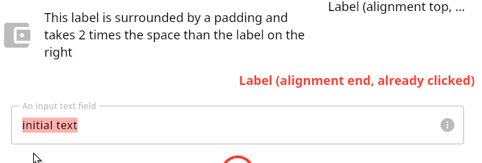
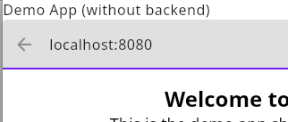
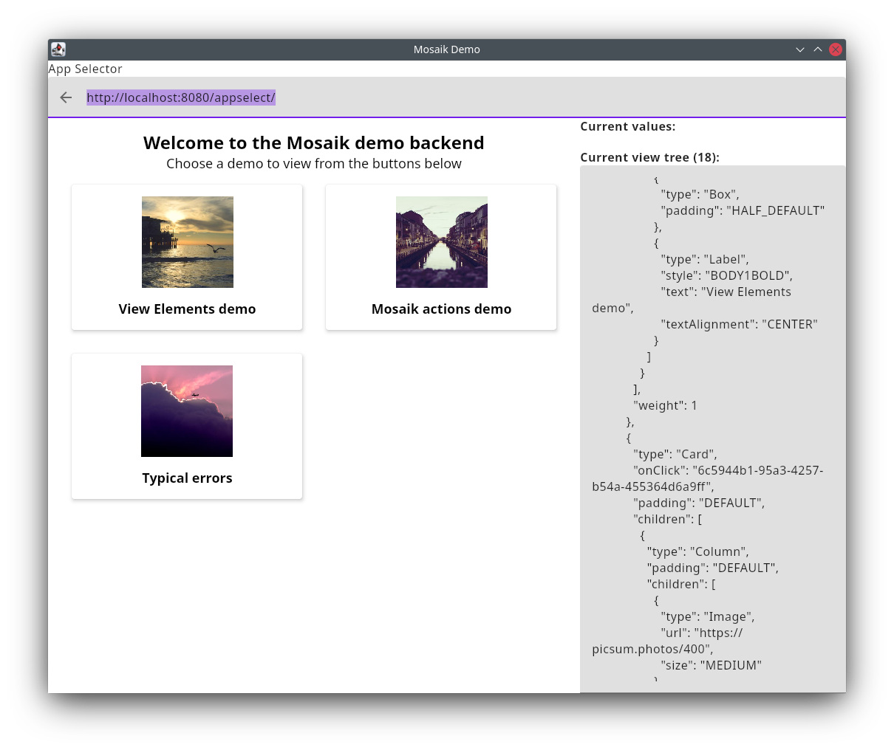

---
tags:
  - JSON
  - dApp Development
---

# *Ergo Mosaik*: A UI system for Ergo dApps

> At its core, Mosaik is a JSON-based markup language served via a REST API intended to be used by Ergo platform dApps. Therefore, it provides elements and interactions typically needed for these.


### On-chain and off-chain code

Ergo is a smart contract platform for decentralized applications to build on, working with bitcoin’s UTXO model. Smart contracts are guard scripts that define when an unspent box can be spent. It is written in ErgoScript, a subset of Scala.

dApp developers need to build off-chain code as well: the ErgoScript contracts are only verified by miners when an actual transaction is submitted to the Ergo network. The logic to build this transaction has to be implemented and run somewhere else. This off-chain aspect does not contradict the general decentralisation: A perfectly decentralized solution is a downloadable open-source client that can build these transactions and submit them to the network. These clients can be built in any programming language possible. SDKs are now available for JVM languages (ergo-appkit: used in Scala, Java and Kotlin projects) and JS languages (sigma-rust). An example of a downloadable client is ErgoMixer.

Typically, the off-chain code is run in a centralized manner for user convenience. Users don’t want to download and set up an application on their local systems, so the off-chain code is hosted on a public server. This concept is used by TokenJay, Ergo Auction House, sigmausd.io, and other services. If the code is open-sourced or smart contracts are well-documented, this is not a problem for decentralization,

While on the one hand, Ergo’s off-chain code is very flexible as we can use it with any programming language, with existing SDKs already covering at least four programming languages. On the other hand, this complicates things for aspiring dApp developers: Which programming language should they use?


### UI code

Another big challenge awaits the developer when that decision is made: A user interface is needed. Many user interface frameworks long to be used, but how should the user interface interact with the off-chain code?

In many cases, the decision is made to write everything in JavaScript. Many capable user interface frameworks are available and run on every platform. Often, the UI code and the off-chain code are done within the user's browser. Doing this is legitimate but restricts the dApp's capabilities as we are then limited to the web dapp connector, and ErgoPay users are excluded. Additionally, this can lead to a poor user experience (an example is Ergo auction house that fetches the blockchain state on every website visit from the user's client).

It is favorable to separate the off-chain and user interface code but creates another problem for aspiring dApp developers as it introduces the need for an actual client/server architecture and perhaps even different programming languages to be used, not to mention the problem of getting transactions signed by the user, which needs some more knowledge by the dApp developers to interact with wallet applications.


### Ergo Mosaik UI system

Ergo Mosaik UI system is a concept to solve this problem. It is designed to not restrict dApp developers in how they want to implement their dApp. Instead, it enhances the possibilities for experienced dApp developers while taking aspiring dApp developers at hand and providing a solution for working with off-chain code and user interfaces, supporting all types of wallets and platforms in the future.

At its core, Mosaik is a **JSON-based markup language served via a REST API** intended to be used by Ergo platform dApps. Therefore, it provides elements and interactions typically needed for these.

Mosaik elements can't be skinned and adapted in their appearance by the dApp - the actual appearance is defined by the **Mosaik executor** application, which in many cases will be a user's wallet application. To gain interactivity, the language defines not only **view elements** but also **actions**. Mosaik's strength is that the view elements and actions provided target typical use cases of blockchain dapps: for example, it provides an ErgoAmountInputField that lets the user input an Ergo Amount - if wanted, even showing a fiat comparison value - and gives the dApp the nanoerg amount without any rounding issues.

While the core is JSON-based, so that Mosaik libraries can easily be written in any preferred programming language, the Mosaik reference implementation also contains an easy-to-use domain-specific language for Kotlin, making writing Mosaik views very easy and convenient. The hands-on examples show how to set up a Mosaik app served by the Spring Boot framework, which can be used for off-chain code, automatic jobs and REST APIs.

At the time of this writing, two Mosaik executors are available: A desktop application meant for testing and debugging Mosaik apps and the Ergo Wallet App for Android (experimental feature branch). Integration for iOS wallet app, desktop and browser extension wallets is planned.

While now it is still too early to build a dApp solely on Mosaik, we recommend taking a look at the system and using it as an extension for your existing dApp, as it will give you a lot of visibility once the feature is rolling out to wallet users.


### Mosaik first hands-on

Let’s take a real look at Mosaik to get a feeling for the system. Clone the repository from [https://github.com/MrStahlfelge/mosaik](https://github.com/MrStahlfelge/mosaik) to your local system. You’ll need Java 11 or newer installed for the next steps. Start the Mosaik Desktop Executor (which also serves as a debugging tool) by invoking the following command.

`./gradlew desktop-demo:run` (or `gradlew desktop-demo:run` on Windows). Once downloading the necessary dependencies and compiling is done, you will be presented with the following window:


The column on the right gives you info on the input values that the current view holds, as well as the JSON model that is currently shown. Most space is reserved for the actual Mosaik app that is running. The debugger shows a simple built-in app demonstrating a few view elements and actions. Let’s take a closer look at the JSON on the right-hand side. If you copy it in a better-suited editor, you’ll see that its outermost object contains two properties:


```
    {
      "actions": [...],
      "view": {
    	"type": "Column",
    	"children": [...]
      }
    }
```


The Mosaik app consists of actions and view elements. Here, the root view element is a column. One of the child view elements is the label that shows the text “Label (alignment end, click it)


```
    {
     "id": "clickLabel",
     "type": "Label",
     "text": "Label (alignment end, click it)",
     "align": "END",
     "style": "BODY1BOLD",
     "onClick": "replaceLabel"
    }
```


If you click this label in the desktop application, you will see that the view changes:



This was caused by the onClick attribute defined on the JSON above. It references “replaceLabel”. When you look at the list of defined actions, you’ll find this action declared as follows:


```
    {
     "type": "ChangeSiteAction",
     "id": "replaceLabel",
     "newContent": {
       "view": {
         "id": "clickLabel",
         "type": "Label",
         "text": "Label (alignment end, already clicked)",
         "align": "END",
         "style": "BODY1BOLD",
         "textColor": "PRIMARY"
       }
     }
    }
```


Clicking on the label that was first shown caused a “ChangeSiteAction” to be launched, replacing the label with a new one with a different text and color. It is essential to understand that the original label was replaced, not changed, to have a new text and color. All Mosaik elements are immutable.

Before we look at a more interesting example, let’s try a simple feature the desktop executor provides that might come in handy when designing your own apps.

Locate the definition for the headline label defined as follows in the right-hand pane:


```
    {
        	"type": "Label",
        	"style": "HEADLINE2",
        	"text": "Welcome to Mosaik demo app"
    }
```


Now change the style to `HEADLINE1`. You’ll see the view immediately changing. (You can edit directly from within this view!)

The Mosaik repository ships with a Mosaik app that demonstrates all available view elements and actions. Remember that you are working in a desktop debugging tool when trying it out. Some actions and view elements make sense to be used from within an actual wallet application and are only implemented in a debugger style for you to tweak.

You can fire up the view elements and actions demo by calling the following command from the Mosaik repo’s directory:

`./gradlew ergo-mosaik:backend-demo-kotlin:bootRun` (or `gradlew ergo-mosaik:backend-demo-kotlin:bootRun` on Windows)

After some compiling, the app is waiting to get fetched on port 8080:


```
Tomcat started on port(s): 8080 (http) with context path ''
```


Navigate to localhost:8080 by entering this into the navigation bar and hit enter:




Mosaik automatically determines that the actual Mosaik app is served from the path /appselect/ and presents a chooser. Let’s ignore the “typical errors” demo for now (it is meant to be checked by Mosaik executor developers) and make your choice!

As this demo is not a built-in into the desktop debugger, it can be launched from an other existing Mosaik executor, the Ergo Wallet App for Android, as well:




Other existing Mosaik executors are Ergo Wallet App for Desktop and the MosaikJS executor to run Mosaik apps in browser.

Check out the view elements and actions provided, and feel free to check out the JSON shown in the desktop debugger.

The JSON is not meant to be generated manually, and Mosaik provides a robust abstraction layer. You will find a link to the page's source code if you visit the demo. We will take a look at this code in the following tutorials.
